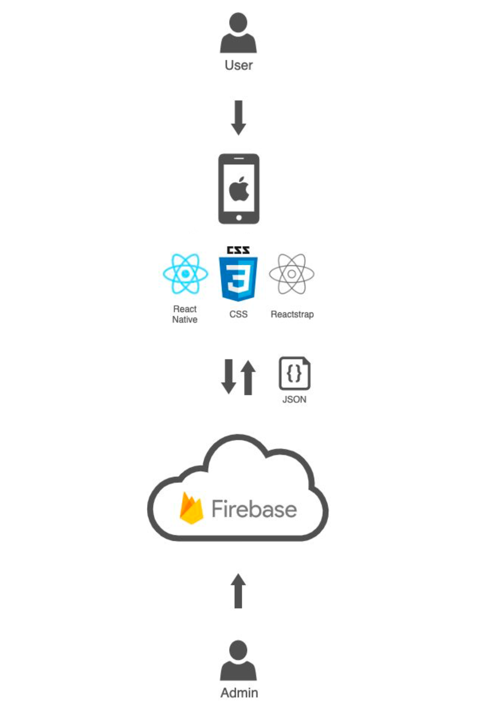
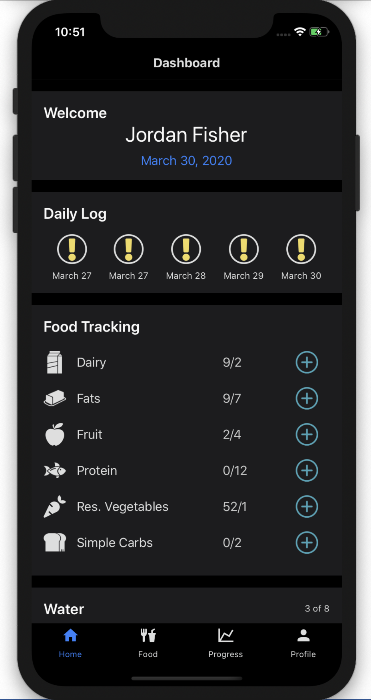
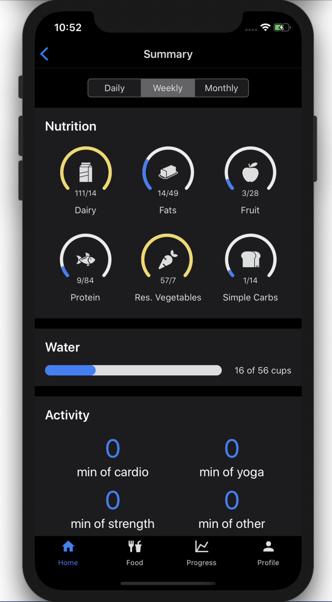
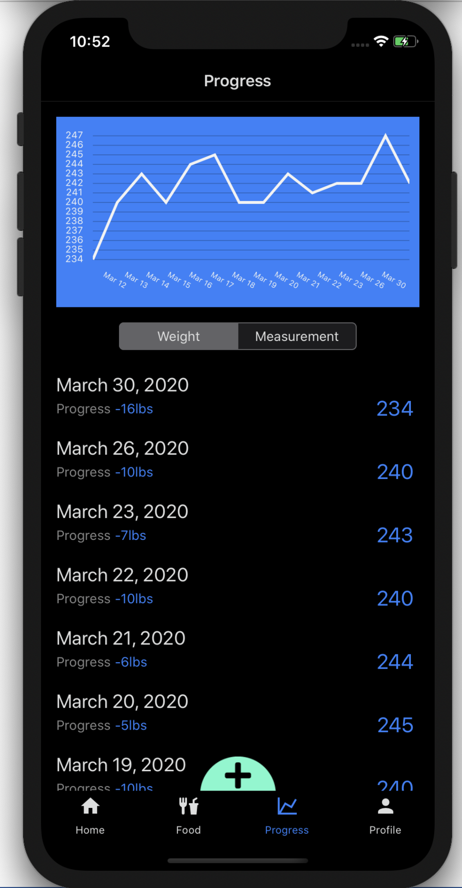

<!-- Team Logo -->

<p align="center">
      
      <h3 align="center">We are Infinite Studio</h3>
</p>

<!-- TABLE OF CONTENTS -->
## Table of Contents

* [About the Project](#about-the-project)
  * [Built With](#built-with)
* [Features](#features)
* [Design](#design)
  * [User Research](#User-Research)
  * [Product Research](#Product-Research)
  * [Personas](#Personas)
  * [User Stories](#User-Stories)
  * [Information Architecture](#Information-Architecture)
  * [Paper Prototypes](#Paper-Prototypes)
  * [UI Wireframes](#UI-Wireframes)
  * [Visual Design](#Visual-Design)
  * [Interactive Visual Mockup](#Interactive-Visual-Mockup)
* [Technical Research](#technical-research)
* [High-Level Architecture](#high-level-architecture)
* [Getting Started](#getting-started)
  * [Prerequisites](#prerequisites)
  * [Installation](#installation)
* [Firebase Console](#firebase-console)
* [Usage](#usage)
* [Roadmap](#roadmap)
* [Contact](#contact)
* [Acknowledgements](#acknowledgements)

<!-- ABOUT THE PROJECT -->
## About The Project


<p>
      Bishop Nutrition an app made specifically for Dr. Bishop's Weight Management Clinic. It is meant to replace their current paper food tracking sheets. We have implemented not only food tracking, but also water, activity, mood, and sleep tracking. We have worked hard to streamline the way their clients track their food intake with our quick select food tracking.
</p>

### Built With
* [React Native](https://reactnative.dev/)
* [Firebase](https://firebase.google.com/)

<!-- Features list -->
## Features
- [x] Food Tracking
- [x] Quick Select Tracking
- [x] Add food to favourites
- [x] Water Tracking
- [x] Sleep Tracking
- [x] Mood Tracking
- [x] Activity Tracking
- [x] Daily Log (shows completed or if user went over recommended amount of food)
- [x] Summary Screen showing daily, weekly, monthly progress (visual)
- [x] Line Graph showing weight progress
- [x] Update Password
- [x] Reset Password

<!-- Design -->
## Design

### User Research
Prior to our first meeting with Dr. Bishop’s team we performed an online questionnaire to get background on what people are currently doing in their weight loss journey.  We had 47 responses from various weight loss support groups on Facebook.

https://drive.google.com/open?id=14aY9TicoWwLX2yNMMk7ZUmKAoIB2gBz2

### Product Research
There are many health tracking and activity tracking apps available directly to users.  Since none of these have access to Dr. Bishop’s plans, they are not a direct competitor, however, many clients are using them as a substitute to the current pen and paper tracking method.  Some of the most popular apps clients are using are MyFitnessPal, Fitbit, Baritastic.

https://drive.google.com/open?id=1K5FHKWSVlSwySJ4C4wgDjA_WMB9eh__3

### Personas
For our personas, we went with 4 different users. Dr. Bishops client demographic is mainly females in their 50s, so we went with 3 female users and 1 male user. 3 of the users are current clients and 1 is a brand new client.

https://drive.google.com/open?id=1387qhs2EYz_Ou3537uV_ufQk7DlbG1Vd

### User Stories
We really wanted each user to focus on 1 main feature that we could get feedback on. With 4 personas we made 1 user focus on weight tracking, 1 focused on getting setup as a new user, 1 focused on food tracking and the last user to be focused on viewing progression.

https://drive.google.com/open?id=1zSA50---HBIUiEDiYo8AraVu366Wx_4A

### Information Architecture
The information architecture is meant to show how the app will be structured. Our main focus was to make sure the user didn't have to travel to any part of our app, we wanted as few clicks as possible. With most food tracking apps out currently being very confusing to use, we really wanted our users to feel comfortable and not overwhelmed.

https://drive.google.com/open?id=123Zaiffxd8qBEB1BL1U9yJbAK_LfxeBm

### Paper Prototypes
Paper protyopes are rough design sketches of the app. For our paper prototypes we had multiple team memembers draw a very rough sketch of our main screens just to get all our ideas on paper. We then discussed which ideas were best and made a master paper prototype.

https://drive.google.com/open?id=1TZNX8EEwfG6HA6oArT19qph94DIAy2tL

### UI Wireframes
The UI wireframes are a more polished version of the paper prototype (without colour) but this time using a tool such as XD. We used XD to transfer all the ideas from the paper prototype into a digital format. 

https://drive.google.com/open?id=172Ttlo__FNOH6dA8NiV3Jma0_VUens8V

### Visual Design
Visual design is when you add colour and real content into the prototype. We picked our colour palette based off Dr. Bishops website colours and created icons and real data to put into the prototype. Dr. Bishop loved the idea of dark mode so thats what we went with.

https://drive.google.com/open?id=1VajEBBqufJmqhtj8s8O2Wo37V6GCa1Et

### Interactive Visual Mockup
The intereactive visual mockup is a working prototype that will be used for testing. We used XD to create our interactive visual mockup. 

https://xd.adobe.com/view/6011869d-8624-48dd-6b96-4c3207fad670-1620/?fullscreen&hints=off

<!-- Technical Research -->
## Technical Research

The following document outlines the technical research results prior to the development stage of the project. The techlogies we investigated range from front end frameworks, data visualization tools, and database options.

https://docs.google.com/document/d/1tOJZMeHA1UNSjviJtnpPhF14Q_bjxfEq7NiJS2xbP_c/edit?usp=sharing

<!-- High-Level Architecture -->
## High-Level Architecture

 

We decided to build the app using React Native, with the help of Firebase on the backend. React Native allowed us to build out features using JavaScript and JSX, while still being able to run the app on a device 100% natively. Firebase was a great tool for what we needed. It provided the necessary authentication functionality as well as a document database where we could store user data, food plans, and a food list. Firebase also has a useful console that can be accessed and edited by the adminstrator of the app.

<!-- Getting Started -->
## Getting Started

### Prerequisites

These are the tools you will need to use the app.

* yarn
```sh
brew install yarn
```
* CocoaPods
```sh
sudo gem install cocoapods
```
* Xcode, available on the Mac App Store.
* Apple ID

### Installation

1. Clone the repo.
```sh
git clone -b native-0.1.9 --single-branch https://github.com/alla0243/bishop-nutrition.git
```
2. Navigate into the folder.
```sh
cd bishop-nutrition
```
3. Install Yarn packages.
```sh
yarn install
```
4. Navigate into the ios folder.
```sh
cd ios
```
5. Install pod files. You may need to install cocoapods if you haven't before.
```sh
pod install
```
5. In Finder, navigate into the ios folder and open bishop_nutrition.xcworkspace.
6. Plug in your iPhone and select it in the device dropdown. You can also use a simulator. If you choose to use a device, make sure your Apple ID is added to Xcode.
7. In the menu bar, select Product -> Run.
8. The app should install and run on your device. You may need to trust the app in your iPhone's settings.


<!-- FIREBASE -->
## Firebase Console

Google’s Firebase Firestore is the database we’ve been using to store food, plan, and user data. Below are instructions on how to complete three significant tasks in the Firebase [console](https://console.firebase.google.com/u/0/project/bishop-nutrition/overview).

### Add plan
1. Select "Database" in the Develop menu.
2. Select the the "plans" collection.
3. Inside, click "Add document" and give it a short name the relates to the plan.
4. Add the data according to this structure:

```sh
gender: "gender"
name: "Plan Name"
portions: { // of type map
	dairy: {
		dbName: "dairy"
		maxPortions: 2
		name: "Dairy"
	},
	foodCategory2: {
		dbName: "foodCategory2"
		maxPortions: 5
		name: "Food Category 2"
	},
	foodCategory3: {
		dbName: "foodCategory3"
		maxPortions: 5
		name: "Food Category 3"
	}
}
water: {
	maxPortions: 8
	name: "Water"
}
totalPortions: 12 // sum of all maxPortions
```

### Add food item
1. Select "Database" in the Develop menu.
2. Select the "foodList" collection.
3. Select the "allFood" document.
4. Select "Add field". Give it a short descriptive name of type "map".
5. Add the data according to this structure:

```sh
short_descriptive_name: {
	category: "Category Name"
	key: 00000 // random number
	name: "Food item name"
	portionSize: "3/4 cup (180ml)"
	plans: [ // which plans allow this food item
		"plan_1",
		"plan_2"
	]
}
```

### Add new user
1. Select "Authentication" in the Develop menu.
2. Click the "Add user" button.
3. Enter the patients email address and a temporary password.
4. You can now give these credentails to the patient. Make sure they know to change their password immediately after logging in the first time.
Note: Adding a new user does not yet create the necessary data in the database. This is a feature that would need to be added.


<!-- USAGE EXAMPLES -->
## Usage

              

<!-- ROADMAP -->
## Roadmap

List of Sprint two features (and known issues, if any).
- Activity tracking that pulls data from Fitbit API
- Ability to hide certain widgets on home screen
- View progress from specific days
- Encryption of sensitive user data (weight, measurements)

<!-- Contact -->
## Contact

**Project Lead:** [Dylan Durbano](mailto:durb0004@algonquinlive.com)

**Technical Lead:** [Christian Allard](mailto:alla0243@algonquinlive.com)

**Design Lead:** [Jeff Lichty](mailto:lich0020@algonquinlive.com)

**Developer:** [Brinda Shah](mailto:shah0220@algonquinlive.com)

**Developer:** [Viraj Vashi](mailto:vash0006@algonquinlive.com)

**UX Designer:** [Conor Scott](mailto:scot0359@algonquinlive.com)

<!-- Acknowledgements -->
## Acknowledgements
Everyone at Infinite Studio would like the thank our Professors Su Cheng Lee and Adesh Shah for all their support throughout the design and development of Bishop Nutrition. They added a lot of great insight and mentorship towards the app and Infinite Studio team. We are forever grateful for their help in the development of Bishop Nutrition and help to further our knowledge. We'd also like to thank everyone at Dr. Bishop's Weight Management Clinic. Their support and positivity towards the team and development of Bishop Nutrition were truly wonderful. The Infinite Studio team is very grateful for this opportunity and will never forget all the support and dedication that went into this project. Thank you to everyone involved!
